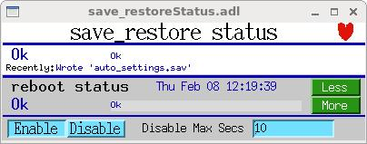
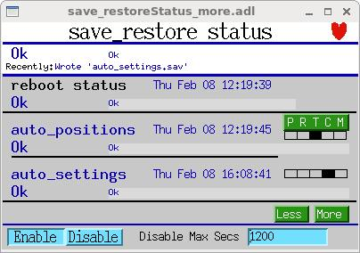

# Autosave Restore

## Table of Contents

- [Overview](#overview)
- [Important Nuances](#important-nuances)
- [How to Use Autosave](#how-to-use-autosave)
- [autosaveBuild (Automatic Request-File Generation)](#autosavebuild-automatic-request-file-generation)
- [asVerify](#asverify)
- [configMenu](#configmenu)
- [About Save Files](#about-save-files)
- [Module Contents](#module-contents)
- [User-Callable Functions](#user-callable-functions)
- [Example of Use](#example-of-use)

---

## Overview

Autosave automatically saves the values of EPICS process variables (PVs) to files on a server and restores those values when the IOC (Input-Output Controller — the business end of EPICS) is rebooted. The original author is Bob Dalesio; improvements were made by various contributors including Frank Lenkszus, Ron Sluiter, Andrew Johnson, Pete Jemian, Markus Janousch, David Maden, Zheqiao Geng, and Michael Davidsaver.

Autosave is a two-part operation:
1. **Run-time save**: Started by commands in the IOC startup file and persists while the IOC is running. It saves PV values to files and supports manual restore operations.
2. **Boot-time restore**: Invoked during iocInit via an EPICS initHook. It restores PV values from files and does not persist after iocInit() returns.

The autosave module also contains:
- **asVerify**: A client program to compare written autosave files with current PV values
- **configMenu**: A facility for creating, saving, finding, restoring, and verifying IOC configurations
- **autosaveBuild**: A facility to generate autosave-request files as part of dbLoadRecords() and dbLoadTemplate()

---

## Important Nuances

- **Boot-time restore**:
  - Uses dbStaticLib to write PVs (like dbLoadRecords())
  - Does not cause record processing to occur
  - Does not set UDF to 0 (except for arrays)
  - Arrays are written using database access

- **Run-time restore**:
  - Uses channel-access for reading and writing
  - May cause record processing to occur
  - Prior to autosave 5.6, arrays were read/written using database access
  - From autosave 5.6, arrays use channel access

- **Restore timing**:
  - Can occur at two times: before record initialization ("pass 0") and after ("pass 1")
  - Choice applies to entire files, not individual PVs
  - Motor-record positions should only be restored during pass 0
  - Arrays cannot be restored during pass 0

- **Save/Restore options**:
  - You can save PVs without restoring them and restore without saving
  - These choices apply to entire files, not individual PVs
  - Automated saves can be enabled/disabled for specified time periods

---

## How to Use Autosave

### 1. Build (required)
Build the module and include the resulting library and database-definition file in your IOC:

```
# In configure/RELEASE
AUTOSAVE=<path to the autosave module>

# In xxxApp/src/Makefile
xxx_LIBS += autosave
xxx_DBD += asSupport.dbd
```

### 2. Write Request Files (optional but common)
Create files specifying PVs to save and restore:

```
# Example auto_settings.req
xxx:m1.VAL
xxx:m2.VAL
```

Request files can use macro variables:
```
$(P)m1.VAL
$(P)m2.VAL
```

And can include other request files:
```
file motor_settings.req P=xxx:,M=m1
```

### 3. Set Request-File Path (optional, recommended)
Specify directories to search for request files:

```
# For systems using cdCommands
set_requestfile_path(startup, "")
set_requestfile_path(startup, "autosave")
set_requestfile_path(area_detector, "ADApp/Db")

# For systems using envPaths
set_requestfile_path("$(TOP)/iocBoot/$(IOC)", "")
set_requestfile_path("$(TOP)/iocBoot/$(IOC)", "autosave")
set_requestfile_path("$(AREA_DETECTOR)", "ADApp/Db")
```

### 4. Set NFS Host (optional, only for vxWorks and RTEMS)
```
save_restoreSet_NFSHost("oxygen", "164.54.49.4")
```

### 5. Use NFS (required on vxWorks)
Use NFS for file operations. Autosave is tested with NFS and may not work with vxWorks' netDrv.

### 6. Set Save/Restore File Path (optional but common)
```
set_savefile_path("/full/path")
```

### 7. Give Write Permission (required)
Ensure the IOC has write permission to the autosave directory.

### 8. Specify Restore Files (optional but common)
```
set_pass0_restoreFile("auto_settings.sav", "P=xxx:")
set_pass1_restoreFile("auto_settings.sav", "P=xxx:")
```

Notes on restore passes:
- Link fields can only be restored in pass 0
- Motor record DVAL is only used if hardware value is zero
- Arrays cannot be restored during pass 0
- Scalar PVs with DBF_NOACCESS type cannot be restored in pass 0

### 9. Load initHook Routine (required for boot-time restore)
This happens automatically if the IOC is built as described.

### 10. Select Save-File Options (optional, recommended)
```
# Enable dated backup files
save_restoreSet_DatedBackupFiles(1)

# Configure sequence files
save_restoreSet_NumSeqFiles(3)
save_restoreSet_SeqPeriodInSeconds(600)

# Set retry delay
save_restoreSet_RetrySeconds(60)

# Enable reconnection attempts
save_restoreSet_CAReconnect(1)

# Set forced save interval
save_restoreSet_CallbackTimeout(-1)
```

### 11. Disable/Enable Saving at Runtime (optional)
The `save_restoreStatus.db` database includes two PVs for temporarily disabling autosave at runtime:

- **`$(P)SR_disable`**: A bo record. Setting this to 1 ("Disable") stops autosave from writing save files. Setting it to 0 ("Enable") resumes saving.
- **`$(P)SR_disableMaxSecs`**: A longout record. If `SR_disable` is set, autosave will automatically re-enable itself after this many seconds have elapsed. If set to 0, autosave remains disabled until manually re-enabled.

This is useful during maintenance or large batch operations where frequent saves are unnecessary or could interfere.

### 12. Start the Save Task (required to save files)
```
create_monitor_set("auto_positions.req", 5, "P=xxx:")
create_monitor_set("auto_settings.req", 30, "P=xxx:")
```

---

## autosaveBuild (Automatic Request-File Generation)

This facility generates request files from dbLoadRecords() and dbLoadTemplate() calls. It requires EPICS 3.14.12.5+ or a patched earlier version.

To enable:
1. Edit asApp/src/Makefile and uncomment:
   ```
   #USR_CFLAGS += -DDBLOADRECORDSHOOKREGISTER
   ```

2. Use autosaveBuild() in your startup script:
   ```
   autosaveBuild("built_settings.req", "_settings.req", 1)
   ```

This tells autosave to:
1. Build the file "built_settings.req"
2. Generate request-file names by replacing ".db"/".vdb"/".template" with "_settings.req"
3. Enable automated building

Options:
- Specify multiple suffixes:
  ```
  autosaveBuild("built_settings.req", "_settings.req", 1)
  autosaveBuild("built_settings.req", ".req", 1)
  ```

- Disable specific combinations:
  ```
  autosaveBuild("built_settings.req", "_settings.req", 0)
  autosaveBuild("built_settings.req", "*", 0)
  ```

- Add lines manually:
  ```
  appendToFile("built_settings.req", '$(P)userStringSeqEnable')
  ```

---

## asVerify

asVerify compares autosave files with current PV values and can write new save files.

Command line:
```
usage: asVerify [-vrd] <autosave_file>
         -v (verbose) causes all PV's to be printed out
         -r (restore_file) writes a restore file named '<autosave_file>.asVerify'
         -d (debug) increment debug level by one.
```

Examples:
```
asVerify auto_settings.sav
asVerify -v auto_settings.sav
asVerify -vr auto_settings.sav
```

From IOC console (R5.6.1+):
```
asVerify("auto_settings.sav")
asVerify("auto_settings.sav",0,"junk.sav")
```

---

## configMenu

configMenu manages sets of EPICS PVs ("configurations") on a running IOC. It can create, save, find, restore, and verify configurations. Full information can be found [here](configMenu.md).

### Example Setup

1. Create a request file "scan1Menu.req":
   ```
   file configMenu.req P=$(P),CONFIG=$(CONFIG)
   file scan_settings.req P=$(P),S=scan2
   file scan_settings.req P=$(P),S=scan1
   file scan_settings.req P=$(P),S=scanH
   ```

2. Add to st.cmd:
   ```
   # Before iocInit
   dbLoadRecords("$(AUTOSAVE)/asApp/Db/configMenu.db","P=xxx:,CONFIG=scan1")

   # After iocInit
   create_manual_set("scan1Menu.req","P=xxx:,CONFIG=scan1,CONFIGMENU=1")
   ```

3. Add to auto_settings.req (optional):
   ```
   file configMenu_settings.req P=$(P),CONFIG=scan1
   ```

---

## About Save Files

PV values in save files are converted to strings. Special handling applies to:
- **double**: Converted with "%.14g" format
- **float**: Converted with "%.7g" format
- **menu and enum**: Saved as integers
- **arrays**: Read using database access

Sample save file:
```
# save/restore V4.9	Automatically generated - DO NOT MODIFY - 060720-154526
! 1 channel(s) not connected - or not all gets were successful
xxx:SR_ao.DISP 0 (uchar)
xxx:SR_ao.PREC 1 (short)
xxx:SR_bo.IVOV 2 (ushort)
xxx:SR_ao.SCAN 3 (enum - saved/restored as a short)
xxx:SR_ao.VAL 4.1234567890123 (double, printed with format "%.14g")
xxx:SR_scaler.RATE 1.234568 (float, printed with format "%.7g")
xxx:SR_ao.DESC description (string)
xxx:myCalc.CALC$ 123456789+123456789+123456789+123456789+123456789 (long string)
xxx:SR_ao.OUT xxx:SR_bo.VAL NPP NMS (link)
xxx:SR_ao.RVAL 4 (long)
xxx:SR_bi.SVAL 2 (ulong)
#i_dont_exist.VAL Search Issued (no such PV)
xxx:SR_char_array @array@ { "1" "2" "3" "4" "5" "6" "7" "8" "9" "10" }
<END>
```

Save files must end with `<END>` followed by one or two characters. Lines can be commented with '#'.

---

## Module Contents

### asApp/src
- **save_restore.c**: Saves PV values according to preset rules
- **dbrestore.c**: Restores PV values at boot time
- **initHooks.c**: Calls restore routines at correct boot time
- **verify.c**: Compares autosave files with current values
- **asVerify.c**: Client-side verification tool
- **configMenuSub.c**: aSub routines for configMenu

### asApp/Db
- **save_restoreStatus.db**: Reports status
- **infoExample.db**: Example with info nodes
- **SR_test.db**: Test database
- **configMenu.db**: Configuration management support

### asApp/op/adl (also ../ui, ../edl, ../opi)
- **save_restoreStatus\*.adl**: Status displays
- **configMenu\*.adl**: Configuration management displays

### Status Displays

The save_restoreStatus displays show the current state of all save sets, including connection status, save times, and any errors.



The detailed status display shows additional information for each save set:



---

## User-Callable Functions

Below are listed some common IOC shell functions. Full information on them can be found [here](userFunctions.md)

**Configuration:**
- **save_restoreSet_DatedBackupFiles**: Configure backup file naming
- **save_restoreSet_periodicDatedBackups**: Enable periodic dated backups
- **save_restoreSet_NumSeqFiles**: Set number of sequenced backup files
- **save_restoreSet_SeqPeriodInSeconds**: Set interval between sequenced backups
- **save_restoreSet_RetrySeconds**: Set delay between failed write and retry
- **save_restoreSet_CallbackTimeout**: Set interval between forced writes
- **save_restoreSet_CAReconnect**: Enable periodic PV reconnection
- **save_restoreSet_IncompleteSetsOk**: Allow saving/restoring incomplete sets
- **save_restoreSet_FilePermissions**: Set file permissions for .sav files
- **save_restoreSet_NFSHost**: Specify NFS host (vxWorks/RTEMS)
- **save_restoreSet_status_prefix**: Set prefix for status PVs
- **save_restoreSet_UseStatusPVs**: Enable/disable status PVs
- **set_saveTask_priority**: Set the save_restore task priority

**Save Set Management:**
- **create_monitor_set**: Create a save set triggered by PV changes
- **create_periodic_set**: Create a save set with time-based saving
- **create_triggered_set**: Create a save set with trigger-based saving
- **create_manual_set**: Create a save set for manual saving
- **manual_save**: Manually save current PV values
- **reload_monitor_set**: Change PVs and period for a monitor save set
- **reload_periodic_set**: Change PVs and period for a periodic save set
- **reload_triggered_set**: Change PVs and trigger for a triggered save set
- **reload_manual_set**: Change PVs in a manual save set
- **remove_data_set**: Delete a save set
- **set_savefile_name**: Change the save file name for a save set

**File Paths:**
- **set_requestfile_path**: Set path for request files
- **set_savefile_path**: Set path for save files

**Restore:**
- **set_pass0_restoreFile**: Specify files for pass 0 restore
- **set_pass1_restoreFile**: Specify files for pass 1 restore
- **fdbrestore**: Restore PVs from a save file at runtime
- **fdbrestoreX**: Restore PVs from any file at runtime (no backup, no `<END>` required)

**Status and Debug:**
- **save_restoreSet_Debug**: Set debug level
- **save_restoreShow**: List save sets and their PVs

**autosaveBuild:**
- **autosaveBuild**: Configure automatic request-file generation
- **eraseFile**: Erase a file's contents
- **appendToFile**: Add a line to a request file

**Verification:**
- **asVerify**: Compare PV values with saved values

**Info Node:**
- **makeAutosaveFiles**: Generate request files from info nodes
- **makeAutosaveFileFromDbInfo**: Generate a request file from specific info nodes

---

## Example of Use

```
# Load database
dbLoadDatabase("$(TOP)/dbd/iocxxxVX.dbd")
iocxxxVX_registerRecordDeviceDriver(pdbbase)

### autoSaveRestore setup
save_restoreSet_Debug(0)
save_restoreSet_status_prefix("xxx:")
save_restoreSet_IncompleteSetsOk(1)
save_restoreSet_DatedBackupFiles(1)

# Specify paths
set_savefile_path(startup, "autosave")
set_requestfile_path(startup, "")
set_requestfile_path(std, "stdApp/Db")
set_requestfile_path(motor, "motorApp/Db")

# Specify restore files
set_pass0_restoreFile("auto_positions.sav")
set_pass0_restoreFile("auto_settings.sav")
set_pass1_restoreFile("auto_settings.sav")

# Configure options
save_restoreSet_NumSeqFiles(3)
save_restoreSet_SeqPeriodInSeconds(600)
save_restoreSet_RetrySeconds(60)
save_restoreSet_CAReconnect(1)
save_restoreSet_CallbackTimeout(-1)
save_restoreSet_NFSHost("oxygen", "164.54.49.4")

# Load status database
dbLoadRecords("$(AUTOSAVE)/asApp/Db/save_restoreStatus.db", "P=xxx:")

# After iocInit
create_monitor_set("auto_positions.req", 5, "P=xxx:")
create_monitor_set("auto_settings.req", 30, "P=xxx:")
makeAutosaveFiles()
```
