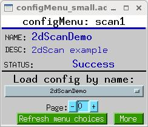
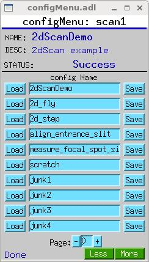
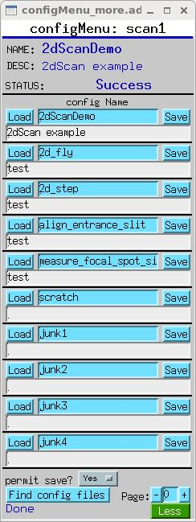

# configMenu

## Table of Contents

- [Overview](#overview)
- [Key Features](#key-features)
- [Setup Instructions](#setup-instructions)
- [User Interface](#user-interface)
- [PV Interface](#pv-interface)
- [Configuration Files](#configuration-files)
- [Advanced Usage](#advanced-usage)
- [Troubleshooting](#troubleshooting)
- [Examples](#examples)

---

## Overview

configMenu is a facility within the Autosave module that allows users to create, save, find, restore, and verify sets of EPICS PVs ("configurations") on a running IOC. It provides a way to manage multiple configurations of the same set of PVs, making it easy to switch between different operational modes.

Unlike the standard Autosave functionality that automatically saves and restores PV values across IOC reboots, configMenu is designed for user-initiated operations to switch between different configurations during runtime. It's comparable to the EPICS Backup and Restore Tool (BURT), but uses autosave files and is driven by EPICS PVs.

---

## Key Features

- **Multiple Configurations**: Store and manage unlimited configurations (as of R5-7)
- **User Interface**: MEDM/EDM/CSS displays for configuration management
- **PV-Driven**: All operations can be triggered via EPICS PVs
- **Callback Support**: Operations can be synchronized with other sequences
- **Dated Backups**: Automatic backup of overwritten configurations
- **Macro Support**: Load configurations with macro substitutions
- **Remote PV Support**: Save/restore PVs from other IOCs

---

## Setup Instructions

### 1. Create a Request File

Create an autosave request file that lists the PVs to be included in your configurations:

```
# Example: scan1Menu.req
file configMenu.req P=$(P),CONFIG=$(CONFIG)
file scan_settings.req P=$(P),S=scan1
file scan_settings.req P=$(P),S=scan2
file scan_settings.req P=$(P),S=scanH
```

### 2. Load the configMenu Database

Add the following to your IOC startup script before `iocInit`:

```
dbLoadRecords("$(AUTOSAVE)/asApp/Db/configMenu.db","P=xxx:,CONFIG=scan1")
```

Options:
- `P`: Prefix for all PVs
- `CONFIG`: Name of this configMenu instance
- `ENABLE_SAVE`: Set to 0 to disable saving (default is 1)

### 3. Create the Manual Set

Add the following to your IOC startup script after `iocInit`:

```
create_manual_set("scan1Menu.req","P=xxx:,CONFIG=scan1,CONFIGMENU=1")
```

The `CONFIGMENU=1` macro tells autosave not to write backup (.savB) and sequence files for this save set.

### 4. Add to auto_settings.req (Optional)

If you want the current configuration name, description, and enableSave selection to be autosaved:

```
file configMenu_settings.req P=$(P),CONFIG=scan1
```

### 5. Set Up CA Reconnect (Recommended for Remote PVs)

If your configurations include PVs from other IOCs:

```
save_restoreSet_CAReconnect(1)
```

---

## User Interface

configMenu provides three main display files:

### configMenu_small.adl



- Compact display with dropdown menu
- Shows current configuration name
- Provides load button
- Includes refresh button to update menu choices

### configMenu.adl



- Shows up to 10 configurations as separate buttons
- Provides load and save buttons for each configuration
- Includes paging controls for navigating through configurations

### configMenu_more.adl



- Extended version with description fields
- Shows up to 10 configurations with descriptions
- Provides load and save buttons for each configuration
- Includes paging controls and save permission toggle

---

## PV Interface

configMenu exposes several PVs that can be used to control and monitor its operation:

### Core PVs

| PV Name | Type | Description |
|---------|------|-------------|
| `$(P)$(CONFIG)Menu` | enum | Menu of available configurations |
| `$(P)$(CONFIG)Menu:name` | string | Current configuration name |
| `$(P)$(CONFIG)Menu:desc` | string | Current configuration description |
| `$(P)$(CONFIG)Menu:status` | string | Status of last operation |
| `$(P)$(CONFIG)Menu:message` | string | Message from last operation |
| `$(P)$(CONFIG)Menu:busy` | binary | 1 when an operation is in progress |
| `$(P)$(CONFIG)Menu:enableSave` | binary | Controls whether saving is allowed |

### Configuration PVs (for each index i=1-10)

| PV Name | Type | Description |
|---------|------|-------------|
| `$(P)$(CONFIG)Menu:name$(i)` | string | Name of configuration i |
| `$(P)$(CONFIG)Menu:desc$(i)` | string | Description of configuration i |

### Control PVs

| PV Name | Type | Description |
|---------|------|-------------|
| `$(P)$(CONFIG)Menu:loadConfig$(i)` | binary | Trigger to load configuration i |
| `$(P)$(CONFIG)Menu:saveConfig$(i)` | binary | Trigger to save configuration i |
| `$(P)$(CONFIG)Menu:loadConfigByName` | string | Load configuration by name |
| `$(P)$(CONFIG)Menu:saveConfigByName` | string | Save configuration by name |
| `$(P)$(CONFIG)Menu:prevPage` | binary | Show previous page of configurations |
| `$(P)$(CONFIG)Menu:nextPage` | binary | Show next page of configurations |
| `$(P)$(CONFIG)Menu:page` | integer | Current page number |
| `$(P)$(CONFIG)Menu:reload` | binary | Reload configuration list |

---

## Configuration Files

### File Naming

Configuration files are saved with the naming convention:

```
<CONFIG>_<name>.cfg
```

Where:
- `<CONFIG>` is the configMenu instance name (e.g., "scan1")
- `<name>` is the configuration name with non-alphanumeric characters replaced by '_'

Example: `scan1_align_entrance_slit.cfg`

### File Format

Configuration files use the same format as autosave .sav files:

```
# save/restore V5.0	Automatically generated - DO NOT MODIFY - 210315-142208
xxx:scan1.P1SP 0 (double)
xxx:scan1.P1EP 10 (double)
xxx:scan1.P1SI 1 (double)
xxx:scan1.NPTS 11 (long)
xxx:scan2.P1SP 0 (double)
xxx:scan2.P1EP 5 (double)
xxx:scan2.P1SI 0.5 (double)
xxx:scan2.NPTS 11 (long)
xxx:scanH.P1SP 0 (double)
xxx:scanH.P1EP 20 (double)
xxx:scanH.P1SI 2 (double)
xxx:scanH.NPTS 11 (long)
<END>
```

### Backup Files

When configMenu overwrites an existing .cfg file, it creates a backup copy with a timestamp:

```
scan1_blank.cfg_130401-140546
```

This file was created at 2:05:46 PM on April 1, 2013.

---

## Advanced Usage

### Using Macros in Configuration Files

You can load .cfg files that contain macros by specifying them in the `create_manual_set()` call:

```
create_manual_set("SGMenu.req","P=xxx:,CONFIG=SG,CONFIGMENU=1,H=softGlue:")
```

This allows you to use the same configuration files across different instances.

### Driving configMenu from Other IOC Code

You can drive configMenu operations from other IOC code using the PV interface. For example:

```c
// Load a configuration
dbpf("xxx:scan1Menu:loadConfigByName", "alignment");

// Wait for operation to complete
while (dbGetField("xxx:scan1Menu:busy", DBR_LONG, &busy, NULL, NULL) == 0 && busy) {
    epicsThreadSleep(0.1);
}

// Save a configuration
dbpf("xxx:scan1Menu:saveConfigByName", "new_alignment");
```

### Using with ca_put_callback

configMenu operations can be driven by a ca_put_callback, allowing them to be part of a larger sequence:

```c
// In a sequence record or similar
pvPut("xxx:scan1Menu:loadConfigByName", "alignment", SYNC);
// Next step will wait until load completes
```

---

## Troubleshooting

### Menu Not Updating

**Problem**: The menu in configMenu_small.adl doesn't update when new configurations are added.

**Solution**: Use the "Refresh menu choices" button to close and reopen the display, or use configMenu.adl which shows configurations as separate PVs that update automatically.

### Cannot Save Configurations

**Problem**: Save buttons are not visible or saving doesn't work.

**Solution**: Check the "permit save?" setting. If it's set to "No", saving is disabled. Change it to "Yes" to enable saving.

### Directory Listing Issues

**Problem**: On vxWorks 5.5.2 with nfs3Drv, directory listings may fail with error "error reading dir <mydirectoryname> errno: 0x300016".

**Solution**: Modify the board-support package to use nfs2Drv instead.

### Remote PV Issues

**Problem**: Configurations with PVs from other IOCs don't load properly.

**Solution**: Ensure `save_restoreSet_CAReconnect(1)` is included in your startup script.

---

## Examples

### Example 1: Motor Positioning Configurations

This example sets up configMenu to manage different motor position configurations:

1. Create `motorPositions.req`:
   ```
   file configMenu.req P=$(P),CONFIG=$(CONFIG)
   $(P)m1.VAL
   $(P)m2.VAL
   $(P)m3.VAL
   $(P)m4.VAL
   ```

2. Add to startup script:
   ```
   dbLoadRecords("$(AUTOSAVE)/asApp/Db/configMenu.db","P=xxx:,CONFIG=motors")
   # After iocInit:
   create_manual_set("motorPositions.req","P=xxx:,CONFIG=motors,CONFIGMENU=1")
   ```

3. Create configurations using the UI:
   - "home" - motors at home positions
   - "sample1" - motors positioned for sample 1
   - "sample2" - motors positioned for sample 2

### Example 2: Scan Configurations

This example sets up configMenu to manage different scan configurations:

1. Create `scanConfigs.req`:
   ```
   file configMenu.req P=$(P),CONFIG=$(CONFIG)
   file scan_settings.req P=$(P),S=scan1
   ```

2. Add to startup script:
   ```
   dbLoadRecords("$(AUTOSAVE)/asApp/Db/configMenu.db","P=xxx:,CONFIG=scans")
   # After iocInit:
   create_manual_set("scanConfigs.req","P=xxx:,CONFIG=scans,CONFIGMENU=1")
   ```

3. Create configurations for different scan types:
   - "quick" - fast, low-resolution scan
   - "detailed" - slow, high-resolution scan
   - "custom" - specialized scan parameters

### Example 3: Driving configMenu from a Script

This example shows how to drive configMenu from a Python script using pyEpics:

```python
import epics
import time

# Load a configuration
epics.caput("xxx:scan1Menu:loadConfigByName", "alignment")

# Wait for operation to complete
while epics.caget("xxx:scan1Menu:busy"):
    time.sleep(0.1)

# Do something with the loaded configuration
# ...

# Save the modified configuration with a new name
epics.caput("xxx:scan1Menu:saveConfigByName", "alignment_modified")
```
